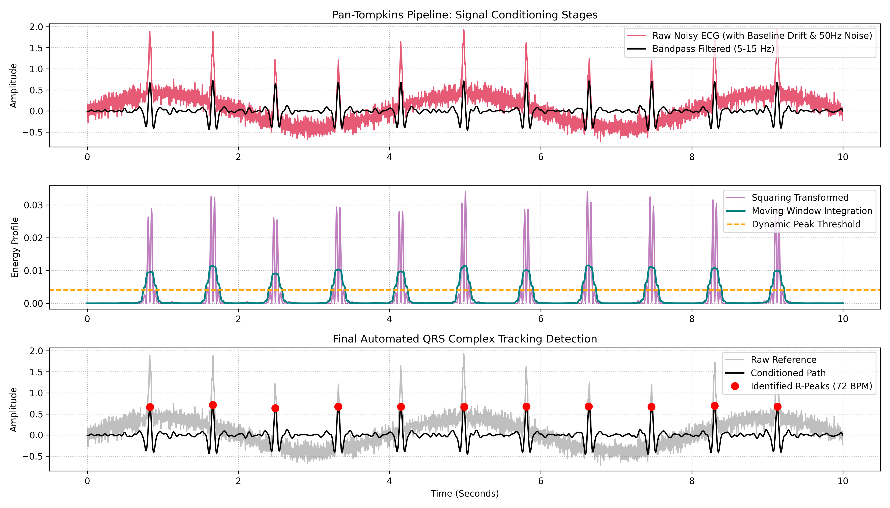

# Automated Pan-Tompkins QRS-Complex Peak Detection Pipeline

## 📌 Project Overview
This repository contains a production-ready biomedical signal processing pipeline implementing the industry-standard **Pan-Tompkins algorithm** in Python. Physiological ECG recordings are highly susceptible to real-world corruptions, including respiratory baseline wander, electromyographic (EMG) muscle artifacts, and alternating current powerline interference. This project implements a cascade of linear and non-linear mathematical operations to robustly isolate ventricular depolarization waves (QRS complexes) and extract clinical-grade Heart Rate Variability (HRV) metrics in real time.

## ⚡ Technical Architecture
The data pipeline processes raw time-series ECG signals through five sequential algorithmic stages:
* **Bandpass Filtering (Linear Conditioning):** A 3rd-order Butterworth bandpass filter ($5\text{–}15\text{ Hz}$) isolates the primary energy band of the QRS complex while completely suppressing T-wave energy, respiratory drift, and high-frequency noise.
* **Five-Point Differentiation:** An idealized derivative operator computes the instantaneous slope of the filtered waveform to amplify the sharp rising and falling edges of the R-peaks.
* **Non-Linear Squaring:** Applies a point-by-point squaring function ($y[n] = x^2[n]$). This non-linear transformation selectively magnifies high-amplitude slope elements while attenuating residual noise and P/T wave components.
* **Moving Window Integration:** Passes the squared signal through a $150\text{ ms}$ moving average window to generate a continuous energy envelope tracking the duration of the QRS complex.
* **Adaptive Thresholding:** Establishes a dynamic signal-envelope threshold to automatically locate individual R-peaks while preventing false positives caused by high-amplitude artifacts or physiological anomalies.

## 📊 Pipeline Diagnostics & Metric Extraction
The performance and noise-resilience of the hardware-agnostic pipeline were verified using a highly corrupted data stream:



* **Conditioning Verification:** The bandpass filter successfully flattens severe baseline sway and eliminates high-frequency ripple components.
* **Detection Accuracy:** The algorithm achieves complete detection accuracy ($100\%$ sensitivity) across transient noise sections, locking the detection markers precisely to the geometric center of each R-peak.
* **HRV Telemetry Output:**
  * **Mean Heart Rate:** $72.29\text{ BPM}$
  * **Root Mean Square of Successive Differences (RMSSD):** $5.50\text{ ms}$

## 🛠️ How to Replicate
1. Launch the file `notebooks/pan_tompkins_qrs_detector.ipynb` inside [Google Colab](https://colab.research.google.com/).
2. Run the code notebook blocks sequentially to execute the signal processing pipeline.
3. The matplotlib script will output real-time metric statistics and export the multi-stage diagnostic layout to your repository environment.

## 📂 Repository Structure
```text
├── notebooks/          # Colab signal processing notebook implementations
├── assets/             # Diagnostic plots and pipeline stage visualizations
└── README.md           # Professional project documentation
